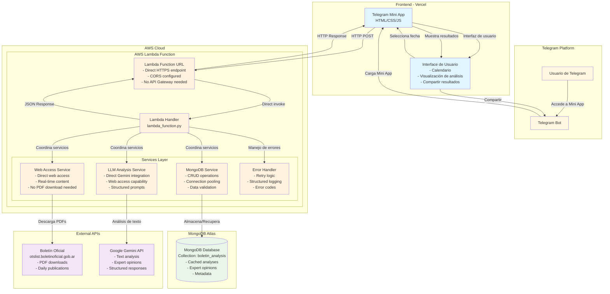
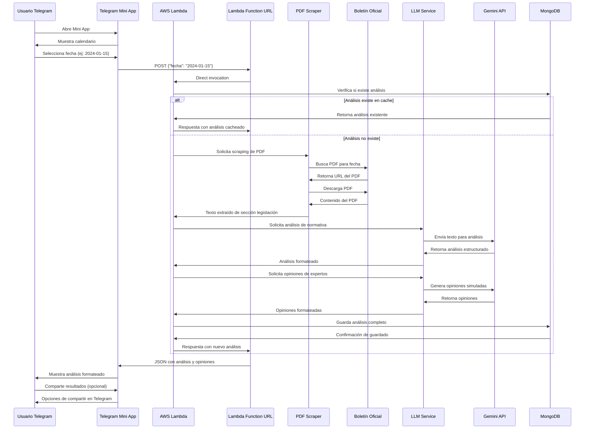
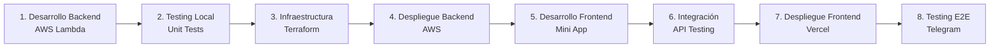

# Arquitectura Completa - AppBoletinOficial

## Diagrama de Arquitectura General



## Flujo de Datos Detallado



## Componentes Técnicos por Capa

### 1. Frontend (Vercel)
```
📱 Telegram Mini App
├── 📄 index.html (Interfaz principal)
├── 🎨 styles.css (Estilos responsivos)
├── ⚡ app.js (Lógica de la aplicación)
├── 📅 calendar.js (Componente calendario)
└── 🔗 telegram-web-app.js (SDK de Telegram)
```

### 2. Backend (AWS Lambda)
```
🚀 AWS Lambda Function
├── 📝 lambda_function.py (Handler principal)
├── 🔧 services/
│   ├── pdf_scraper.py (Scraping y PDF)
│   ├── llm_service.py (Direct Gemini + Web Access)
│   ├── database_service.py (MongoDB)
│   └── config_service.py (Configuración)
├── 🛠️ utils/
│   ├── error_handler.py (Manejo de errores)
│   └── validators.py (Validaciones)
└── 📋 requirements.txt (Dependencias)
```

### 3. Infraestructura (Terraform)
```
🏗️ Infrastructure as Code
├── 📄 main.tf (Recursos principales)
├── 🔧 variables.tf (Variables)
├── 📤 outputs.tf (Outputs)
└── 🔐 iam.tf (Roles y políticas)
```

## Tecnologías por Componente

| Componente | Tecnologías | Propósito |
|------------|-------------|-----------|
| **Frontend** | HTML5, CSS3, JavaScript, Telegram Web App SDK | Interfaz de usuario en Telegram |
| **Function URL** | AWS Lambda Function URL, HTTPS endpoint | Punto de entrada HTTP directo |
| **Backend** | Python 3.11, AWS Lambda | Lógica de negocio serverless |
| **Web Access** | Google Gemini Web Access | Acceso directo a contenido web |
| **AI Analysis** | Google Generative AI, Gemini API | Análisis inteligente con acceso web |
| **Database** | MongoDB Atlas, pymongo | Almacenamiento de análisis |
| **Infrastructure** | Terraform, AWS IAM | Infraestructura como código |
| **Deployment** | Vercel (frontend), AWS (backend) | Hosting y despliegue |

## Flujo de Desarrollo



Este diagrama te muestra el objetivo completo del sistema que vamos a construir. El plan de tareas que creamos se enfoca principalmente en los pasos 1-4 (backend e infraestructura), que son la base fundamental para que después puedas desarrollar el frontend y completar la integración.

¿Te ayuda esta visualización a entender mejor hacia dónde vamos con el desarrollo?